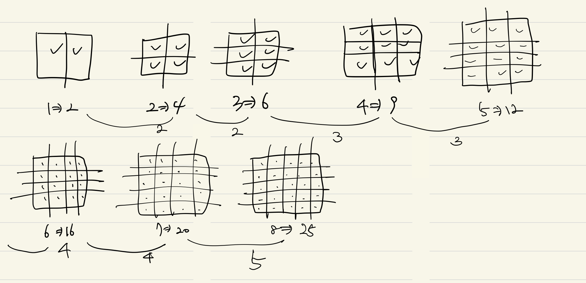

# 백준 문제풀이 (Bronze 4)

---

## TV 크기 (1297번)
https://www.acmicpc.net/problem/1297

### 사전지식
- 피타고라스 정리

### 풀이방법
- `a^2 + b^2 = c^2` 공식 적용
- a : 높이 비율, b : 넓이 비율, c : 대각선 비율
- `9^2 + 16^2 = c^2 -> 337`
- 결국, `c^2 = 337, c = 루트 337, sqrt(337)`이 된다.
- 대각선 비율이 `루트 337, sqrt(337)`이 나왔으므로 `대각선 길이`를 `비율`로 나누면 비율 1당 길이가 나오게 된다.
- 비율 1당 길이에 높이 비율 및 넓이 비율을 곱해서 표현하면 된다.
```java
package Bronze_4;

import java.util.*;
import java.io.*;

public class TV크기_1297 {
    public static void main(String[] args) throws IOException {
        BufferedReader br = new BufferedReader(new InputStreamReader(System.in));
        StringTokenizer st = new StringTokenizer(br.readLine());
        double D = Double.valueOf(st.nextToken());
        double H = Double.valueOf(st.nextToken());
        double W = Double.valueOf(st.nextToken());

        // A^2 + B^2 = C^2
        double distancePerRatio = D / Math.sqrt(H * H + W * W);

        System.out.println((int)(Math.floor(distancePerRatio * H)) + " " + (int)(Math.floor(distancePerRatio * W)));
    }
}
```
---
## A/B (1008번)
https://www.acmicpc.net/problem/1008

### 풀이방법
- double로 데이터를 입력받고 나누기
```java
package Bronze_5;

import java.util.*;
import java.io.*;

public class A_divide_B_1008 {
    public static void main(String[] args) throws IOException {
        BufferedReader br = new BufferedReader(new InputStreamReader(System.in));
        StringTokenizer st = new StringTokenizer(br.readLine());

        double A = Double.valueOf(st.nextToken());
        double B = Double.valueOf(st.nextToken());

        System.out.println(A/B);
    }
}
```
---
## 손익분기점 (1712번)
https://www.acmicpc.net/problem/1712

### 풀이방법
- 가변비용이 노트북 가격보다 크거나 같다면 수익이 나올 수 없기 때문에 절대로 손익분기점이 나올 수 없음 `(B >= C)`
- 노트북 가격에서 가변비용을 빼면 순수익이 나오게 되며 고정비용을 순수익으로 나누면 손익분기점이 나올 수 있는 최소 개수가 나오게 됨
```java
package Bronze_4;

import java.util.*;
import java.io.*;

public class 손익분기점_1712 {
    public static void main(String[] args) throws IOException {
        BufferedReader br = new BufferedReader(new InputStreamReader(System.in));
        StringTokenizer st = new StringTokenizer(br.readLine());

        // 고정비용
        long A = Long.valueOf(st.nextToken());
        // 가변비용
        long B = Long.valueOf(st.nextToken());
        // 노트북 가격
        long C = Long.valueOf(st.nextToken());

        // B >= C -> 손익분기점 X
        // A / (C - B) -> 최초 손익분기점

        if (B >= C) {
            System.out.println(-1);
        }
        else {
            System.out.println(A / (C - B) + 1);
        }
    }
}
```
---
## 사파리월드 (2420번)
https://www.acmicpc.net/problem/2420

### 풀이방법
```java
package Bronze_4;

import java.util.*;
import java.io.*;

public class 사파리월드_2420 {
    public static void main(String[] args) throws IOException {
        BufferedReader br = new BufferedReader(new InputStreamReader(System.in));
        StringTokenizer st = new StringTokenizer(br.readLine());

        long N = Long.valueOf(st.nextToken());
        long M = Long.valueOf(st.nextToken());

        System.out.println(Math.abs(N - M));
    }
}
```
---
## AFC 윔블던 (4299번)
https://www.acmicpc.net/problem/4299

### 주의사항
- 제대로 된 입력의 경우 합이 무조건 차보다 커야 함
- 그러나, 합이 차보다 무조건 크게 **입력**될 것이라는 보장이 없음. 즉, 잘못된 데이터가 들어왔을 때에도 처리해주어야 함 <br>`ex) 합 2 차 4`

### 풀이방법
- 합이 3이고 차가 1일 때, 수식은 다음과 같다.
- `a + b = 3`, `a - b = 1` 일 때, `a + b = 3`을 `a = 3 - b`로 바꾸고 `a - b = 1`을 `a = 1 + b`로 바꾼다.
- `a = 3 - b`에 `a = 1 + b`를 대입하면 `1 + b = 3 - b`가 되고, 정리하면 `2b = 2`에서 `b = 1`이 된다.
- `b`를 구했으면 위 수식 아무곳이나 `b`를 대입해 `a`를 구하면 된다.
- 만약, `2b = 3`과 같이 정수로 떨어지지 않을 경우 a, b를 구할 수 없으므로 -1을 반환한다. `ex) 합 123, 차 90`
```java
package Bronze_4;

import java.util.*;
import java.io.*;

public class AFC_윔블던_4299 {
    public static void main(String[] args) throws IOException {
        BufferedReader br = new BufferedReader(new InputStreamReader(System.in));
        StringTokenizer st = new StringTokenizer(br.readLine());

        int sum = Integer.valueOf(st.nextToken());
        int sub = Integer.valueOf(st.nextToken());


        double b = (sum - sub) / 2.0;
        // 소수점이 있으면 -1
        if ((b % 1 > 0) || (sum < sub)) {
            System.out.println(-1);
            return;
        }

        int a = sum - (int)b;
        if (a > b) {
            System.out.println(a + " " + (int)b);
        }
        else{
            System.out.println((int)b + " " + a);
        }
    }
}
```
---
## 이칙연산 (15726번)
https://www.acmicpc.net/problem/15726

### 풀이방법
- 1 2 3 입력 시 1이 출력되어야 함
- `1 * 2 / 3` => `2/3` => 0
- `1 / 2 * 3` => `3/2` => 1.XXX (소수점 버리기) => 1
```java
package Bronze_4;

import java.util.*;
import java.io.*;

public class 이칙연산_15726 {
    public static void main(String[] args) throws IOException {
        BufferedReader br = new BufferedReader(new InputStreamReader(System.in));
        StringTokenizer st = new StringTokenizer(br.readLine());

        double A = Double.valueOf(st.nextToken());
        double B = Double.valueOf(st.nextToken());
        double C = Double.valueOf(st.nextToken());

        int result = (int)(((A * B / C) > (A / B * C))? (A * B / C) : (A / B * C));
        System.out.println(result);
    }
}
```
---
## 오븐 시계 (2525번)
https://www.acmicpc.net/problem/2525

### 풀이방법
```java
package Bronze_4;

import java.util.*;
import java.io.*;

public class 오븐_시계_2525 {
    public static void main(String[] args) throws IOException {
        BufferedReader br = new BufferedReader(new InputStreamReader(System.in));
        StringTokenizer st = new StringTokenizer(br.readLine());
        int A = Integer.valueOf(st.nextToken());
        int B = Integer.valueOf(st.nextToken());
        int C = Integer.valueOf(br.readLine());

        // 분(B)에 걸리는 시간(C) 더하기
        B += C;
        // 더해진 분(B)을 60으로 나누어 시간에 더함
        A += (B / 60);
        // B의 잔여 분
        B %= 60;
        A %= 24;

        System.out.println(A + " " + B);
    }
}
```
---
## 인공지능 시계 (2530번)
https://www.acmicpc.net/problem/2530

### 풀이방법
```java
package Bronze_4;

import java.util.*;
import java.io.*;

public class 인공지능_시계_2530 {
    public static void main(String[] args) throws IOException {
        BufferedReader br = new BufferedReader(new InputStreamReader(System.in));
        StringTokenizer st = new StringTokenizer(br.readLine());

        int A = Integer.valueOf(st.nextToken()); // 시
        int B = Integer.valueOf(st.nextToken()); // 분
        int C = Integer.valueOf(st.nextToken()); // 초
        int D = Integer.valueOf(br.readLine()); // 걸리는 시간 (초)

        // 초 더하기
        C += D;
        // 분 구하기
        B += (C/60);
        C %= 60;

        A += (B/60);
        B %= 60;

        A %= 24;

        System.out.println(A + " " + B + " " + C);
    }
}
```
---
## 세수정렬 (2752번)
https://www.acmicpc.net/problem/2752

### 사전지식
- 배열 정렬 메소드 사용 방법

### 풀이방법
```java
package Bronze_4;

import java.util.*;
import java.io.*;

public class 세수정렬_2752 {
    public static void main(String[] args) throws IOException {
        BufferedReader br = new BufferedReader(new InputStreamReader(System.in));
        StringTokenizer st = new StringTokenizer(br.readLine());

        int[] arr = new int[3];
        for(int i=0; i<3; i++){
            arr[i] = Integer.valueOf(st.nextToken());
        }

        Arrays.sort(arr);
        for(int i=0; i<3; i++){
            System.out.print(arr[i] + " ");
        }
    }
}
```
---
## 주사위 세개 (2480번)
https://www.acmicpc.net/problem/2480

### 풀이방법
- AB, AC, BC만 확인하면 같은 눈이 무엇인지와 몇 개인지 알 수 있음
```java
package Bronze_4;

import java.util.*;
import java.io.*;

public class 주사위_세개_2480 {
    public static void main(String[] args) throws IOException {
        BufferedReader br = new BufferedReader(new InputStreamReader(System.in));
        StringTokenizer st = new StringTokenizer(br.readLine());

        int A = Integer.valueOf(st.nextToken());
        int B = Integer.valueOf(st.nextToken());
        int C = Integer.valueOf(st.nextToken());

        // AB, AC, BC 만 확인하면 됨
        int duplicateCount = 0;
        int duplicateNumber = 0;
        if (A == B) {
            duplicateCount++;
            duplicateNumber = A;
            if (B == C) {
                duplicateCount++;
            }
        }
        else if (A == C) {
            duplicateNumber = A;
            duplicateCount++;
        }
        else if (B == C) {
            duplicateNumber = B;
            duplicateCount++;
        }

        switch (duplicateCount) {
            // 중복이 없을 때
            case 0:
                int max = A;
                if (B > max) max = B;
                if (C > max) max = C;
                System.out.println(max * 100);
                break;

            // 두 개가 동일할 경우
            case 1:
                System.out.println(1000 + (duplicateNumber * 100));
                break;
            
            // 모두 다 동일한 경우
            case 2:
                System.out.println(10000 + (duplicateNumber * 1000));
                break;
        }
    }
}
```
---
## 체스판 조각 (3004번)
https://www.acmicpc.net/problem/3004

### 풀이방법 1
- 반복문을 이용한 풀이 (내가 푼 방법)
- 체스판을 그려보면 1번 자를때 체스판은 2개가 되고, 3번 자를때 체스판은 6개가 된다. 그리고 4, 5번 자를때는 9, 12가 되는데, 이대로 자르게되면 아래와 같은 규칙이 보인다. 
- `2, 2, 3, 3, 4, 4, 5, 5, 6, 6, ...` 순으로 체스판이 증가한다.


```java
package Bronze_4;

import java.io.*;

public class 체스판_조각_3004 {
    public static void main(String[] args) throws IOException {
        BufferedReader br = new BufferedReader(new InputStreamReader(System.in));
        int N = Integer.valueOf(br.readLine());

        int sum = 0;
        int add = 2;
        for(int i=1; i<=N; i++) {
            if (i%2 == 0 && i != 2) {
                add++;
            }

            sum += add;
        }

        System.out.println(sum);
    }
}
```
## 풀이방법 2
- 공식(?)을 이용한 풀이 (다른 사람의 풀이 방법)
- 그림 (풀이방법 1 이미지 참조)을 그려서 살펴보면, 아래와 같은 결론이 나오게 된다.
- 가로를 보면 `N/2+1` 만큼의 칸이 만들어짐을 알 수 있다.
- 세로를 보면 `N-가로+2` 만큼의 칸이 만들어짐을 알 수 있다.
```java
package Bronze_4;

import java.io.*;

public class 체스판_조각_3004 {
    public static void main(String[] args) throws IOException {
        BufferedReader br = new BufferedReader(new InputStreamReader(System.in));
        int N = Integer.valueOf(br.readLine());

        int x = N/2 + 1;
        int y = N - x + 2;

        System.out.println(x * y);
    }
}
```
---
## 방학 숙제 (5532번)
https://www.acmicpc.net/problem/5532

### 풀이방법
- 주석으로 대체
```java
package Bronze_4;

import java.io.*;

public class 방학_숙제_5532 {
    public static void main(String[] args) throws IOException {
        BufferedReader br = new BufferedReader(new InputStreamReader(System.in));

        // 방학
        int L = Integer.valueOf(br.readLine());
        // 국어 총 페이지 수
        int A = Integer.valueOf(br.readLine());
        // 수학 총 페이지 수
        int B = Integer.valueOf(br.readLine());
        // 하루에 국어 최대 페이지
        int C = Integer.valueOf(br.readLine());
        // 하루에 수학 최대 페이지
        int D = Integer.valueOf(br.readLine());

        int sum = 0;
        // C는 최대 페이지이므로 C보다 작을 수 있음
        // 총 페이지 수를 최대 페이지 수로 나눈 나머지가 있으면
        // 최대 페이지 미만의 페이지가 남아있는 것이므로 하루를 더 해야함
        if (A%C > 0) {
            sum = A/C+1;
        }
        else {
            sum = A/C;
        }

        if (B%D > 0) {
            // sum은 국어를 몇 일동안 푸는지에 대한 결과값이며,
            // B/D+1은 최대 페이지 미만이 남았으므로 하루를 더해줌
            if (sum < B/D+1) {
                // B/D+1 이 sum보다 더 크다면 국어를 푸는 날보다 수학을 푸는 날이 더 많으므로 빼주어야 함
                sum += (B/D+1 - sum);
            }
        }
        else {
            if (sum < B/D) {
                sum += (B/D - sum);
            }
        }

        System.out.println(L - sum);
    }
}
```
## 상근날드 (5543번)
https://www.acmicpc.net/problem/5543

### 풀이방법
- 햄버거와 음료를 변수로 나누어 입력받은 후 각 항목에 대한 최소값 판별

```java
package Bronze_4;

import java.io.*;

public class 상근날드_5543 {
    public static void main(String[] args) throws IOException {
        BufferedReader br = new BufferedReader(new InputStreamReader(System.in));
        int[] food = new int[3];
        food[0] = Integer.valueOf(br.readLine());
        food[1] = Integer.valueOf(br.readLine());
        food[2] = Integer.valueOf(br.readLine());

        int[] juice = new int[2];
        juice[0] = Integer.valueOf(br.readLine());
        juice[1] = Integer.valueOf(br.readLine());

        int minFood = food[0];
        if (food[1] < minFood)
            minFood = food[1];
        if (food[2] < minFood)
            minFood = food[2];

        int minJuice = juice[0];
        if (juice[1] < minJuice)
            minJuice = juice[1];

        System.out.println(minFood+minJuice-50);
    }
}
```
---
## 타임 카드 (5575번)
https://www.acmicpc.net/problem/5575

### 풀이방법
```java
package Bronze_4;

import java.util.*;
import java.io.*;

public class 타임_카드_5575 {
    public static void main(String[] args) throws IOException {
        BufferedReader br = new BufferedReader(new InputStreamReader(System.in));
        StringTokenizer st = null;
        StringBuilder sb = new StringBuilder();

        int H = 0, H1 = 0;
        int M = 0, M1 = 0;
        int S = 0, S1 = 0;
        for(int i=0; i<3; i++) {
            st = new StringTokenizer(br.readLine());
            H = Integer.valueOf(st.nextToken());
            M = Integer.valueOf(st.nextToken());
            S = Integer.valueOf(st.nextToken());
            H1 = Integer.valueOf(st.nextToken());
            M1 = Integer.valueOf(st.nextToken());
            S1 = Integer.valueOf(st.nextToken());

            H1 -= H;
            M1 -= M;
            S1 -= S;

            if (S1 < 0) {
                M1--;
                S1 = 60 + S1;
            }

            if (M1 < 0) {
                H1--;
                M1 = 60 + M1;
            }

            sb.append(H1).append(" ").append(M1).append(" ").append(S1).append("\n");
        }

        System.out.println(sb.toString());
    }
}
```
---
## 시험 점수 (5596번)
https://www.acmicpc.net/problem/5596

### 풀이방법
```java
package Bronze_4;

import java.util.*;
import java.io.*;

public class 시험_점수_5596 {
    public static void main(String[] args) throws IOException {
        BufferedReader br = new BufferedReader(new InputStreamReader(System.in));
        StringTokenizer st = null;

        int max = -1;
        int tmp = 0;
        for(int i=0; i<2; i++) {
            st = new StringTokenizer(br.readLine());
            tmp += Integer.valueOf(st.nextToken());
            tmp += Integer.valueOf(st.nextToken());
            tmp += Integer.valueOf(st.nextToken());
            tmp += Integer.valueOf(st.nextToken());

            if (max < tmp) {
                max = tmp;
            }
            tmp = 0;
        }

        System.out.println(max);
    }
}
```
---
## 17배 (5893번)
https://www.acmicpc.net/problem/5893

### 걸림돌
- 주어지는 N이 1000자리인 것을 간과했다. `2^1000`은 long으로도 해결 불가능한 큰 수이다.
- 처음에는 int형으로 제출했으나 틀려서 long으로 변경 후 제출해도 동일하게 틀렸었다.
### 사전지식
- BigInteger 클래스를 통한 2진수 및 10진수 변환 방법
### 풀이방법
- BigInteger 클래스를 통해 2진수를 10진수로 변환 후 17을 곱하고 다시 2진수로 바꾸어 주었다.
```java
package Bronze_4;

import java.io.*;
import java.math.BigInteger;

public class Seventeen_5893 {
    public static void main(String[] args) throws IOException {
        BufferedReader br = new BufferedReader(new InputStreamReader(System.in));

        BigInteger b = new BigInteger(br.readLine(), 2);
        b = b.multiply(new BigInteger("17"));

        System.out.println(b.toString(2));
    }
}
```
---
## 평균 점수 (10039번)
https://www.acmicpc.net/problem/10039

### 풀이방법
```java
package Bronze_4;

import java.io.*;

public class 평균_점수_10039 {
    public static void main(String[] args) throws IOException {
        BufferedReader br = new BufferedReader(new InputStreamReader(System.in));

        int sum = 0;
        int tmp = 0;
        for(int i=0; i<5; i++) {
            tmp = Integer.parseInt(br.readLine());
            if (tmp < 40) {
                tmp = 40;
            }
            sum += tmp;
        }

        System.out.println(sum / 5);
    }
}
```
---
## 삼각형 외우기 (10101번)
https://www.acmicpc.net/problem/10101

### 걸림돌
- 조건 중 `세 각의 크기가 모두 60이면, Equilateral` 조건을 세 각의 합이 60이면으로 잘못 이해해서 틀렸었다.

### 풀이방법
```java
package Bronze_4;

import java.util.*;
import java.io.*;

public class 삼각형_외우기_10101 {
    public static void main(String[] args) throws IOException {
        BufferedReader br = new BufferedReader(new InputStreamReader(System.in));
        BufferedWriter bw = new BufferedWriter(new OutputStreamWriter(System.out));

        int A = Integer.parseInt(br.readLine());
        int B = Integer.parseInt(br.readLine());
        int C = Integer.parseInt(br.readLine());

        if (A == 60 && B == 60 && C == 60) {
            bw.write("Equilateral");
        }
        else if (A+B+C != 180) {
            bw.write("Error");
        }
        else if (A == B || A == C || B == C) {
            bw.write("Isosceles");
        }
        else {
            bw.write("Scalene");
        }

        bw.flush();
    }
}
```
---
## 과자 (10156번)
https://www.acmicpc.net/problem/10156

### 풀이방법
```java
package Bronze_4;

import java.util.*;
import java.io.*;

public class 과자_10156 {
    public static void main(String[] args) throws IOException {
        BufferedReader br = new BufferedReader(new InputStreamReader(System.in));
        StringTokenizer st = new StringTokenizer(br.readLine());

        int K = Integer.parseInt(st.nextToken());
        int N = Integer.parseInt(st.nextToken());
        int M = Integer.parseInt(st.nextToken());

        System.out.println((K * N - M < 0)? 0 : (K * N - M));
    }
}
```
---
## 전자레인지 (10162번)
https://www.acmicpc.net/problem/10162

### 풀이방법
```java
package Bronze_4;

import java.io.*;

public class 전자레인지_10162 {
    public static void main(String[] args) throws IOException {
        BufferedReader br = new BufferedReader(new InputStreamReader(System.in));

        int T = Integer.parseInt(br.readLine());
        if (T%10 > 0) {
            System.out.println(-1);
            return;
        }

        System.out.println(T/(5*60) + " " + T%(5*60)/60 + " " + T%(5*60)%60/10);
    }
}
```
---